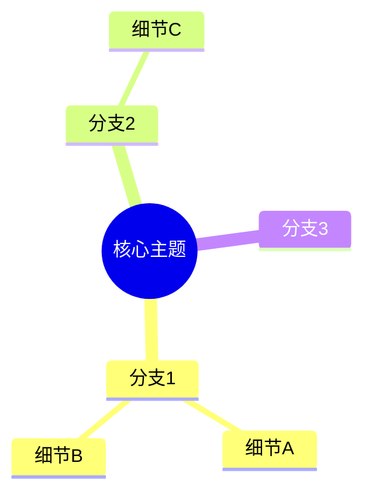

# 🧠 思路梳理工作流

> 前置：先完成 `.agent/core/preflight_checklist.md`，读取 `.agent/runtime/current_task.md`、`.agent/runtime/handoff_note.md`、`.agent/runtime/active_context.md`。
> 本工作流产出的思路梳理文档属于研究类文档，必须遵循 `.agent/protocols/literature_review.md` 与 `.agent/core/output_templates.md` 中的理解辅助结构。

## 何时使用

- 研究方向感到迷茫时
- 需要整理大量信息时
- 准备开题/中期/答辩时
- 需要向他人解释研究时

## 梳理步骤

### 1. 选择梳理主题

确定要梳理的具体内容:
- 整体研究框架
- 某个具体问题
- 方法论对比
- 文献综述结构

### 2. 创建思路文档

在 `notes/thinking/` 创建文件:

```markdown
# [主题] 思路梳理

📅 日期: YYYY-MM-DD

## 🎯 目标

我想要理清...

## 🗺️ 思维导图



## 📝 详细分析

### 1. [要点1]
...

### 2. [要点2]
...

## 💡 关键洞察

通过梳理，我发现...

## ❓ 待解决问题

- 问题1
- 问题2

## 📋 下一步行动

- [ ] 行动1
- [ ] 行动2
```

### 3. 迭代完善

- 初稿不需要完美
- 之后可以不断补充和修改
- 定期回顾和更新

## 常用思维导图结构

### 研究问题分析
```
问题 -> 原因分析 -> 解决方案 -> 验证方法
```

### 方法对比
```
方法A vs 方法B: 优势、劣势、适用场景
```

### 时间线
```
过去工作 -> 当前进展 -> 未来计划
```
